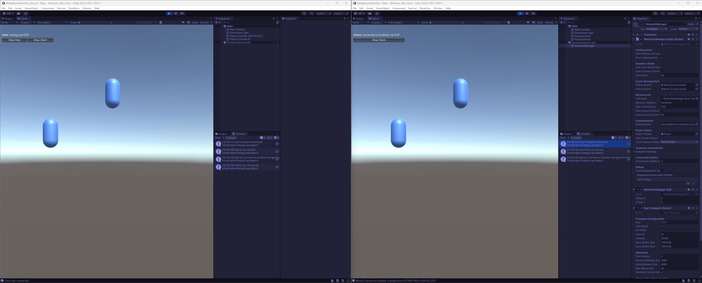

# MultiplayerGameTest

Testing game networking using Unity 2022 LTS

Using the Mirror Library under Unity 2022 LTS, this is a sample project aiming to test multiplayer connectivity between server and client.

